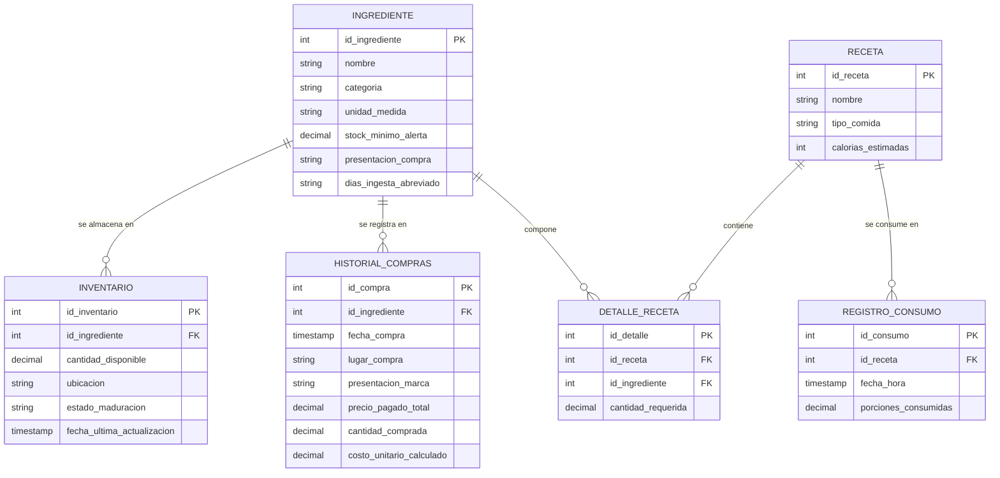

# Modelo entidad-relación

El archivo [`../db/init.sql`](../db/init.sql) implementa este modelo inicial. `INVENTARIO` representa lotes: el mismo ingrediente puede tener existencias separadas por ubicación y estado de maduración.

## Reglas implementadas

- `HISTORIAL_COMPRAS.costo_unitario_calculado` es una columna generada por PostgreSQL.
- `DETALLE_RECETA` es la entidad asociativa que resuelve la relación muchos-a-muchos entre recetas e ingredientes.
- El consumo y la confirmación de compras ocurren dentro de transacciones SQL; el consumo rechaza operaciones que dejarían stock negativo.
- La combinación `id_ingrediente`, `ubicacion` y `estado_maduracion` identifica un lote lógico de inventario.
